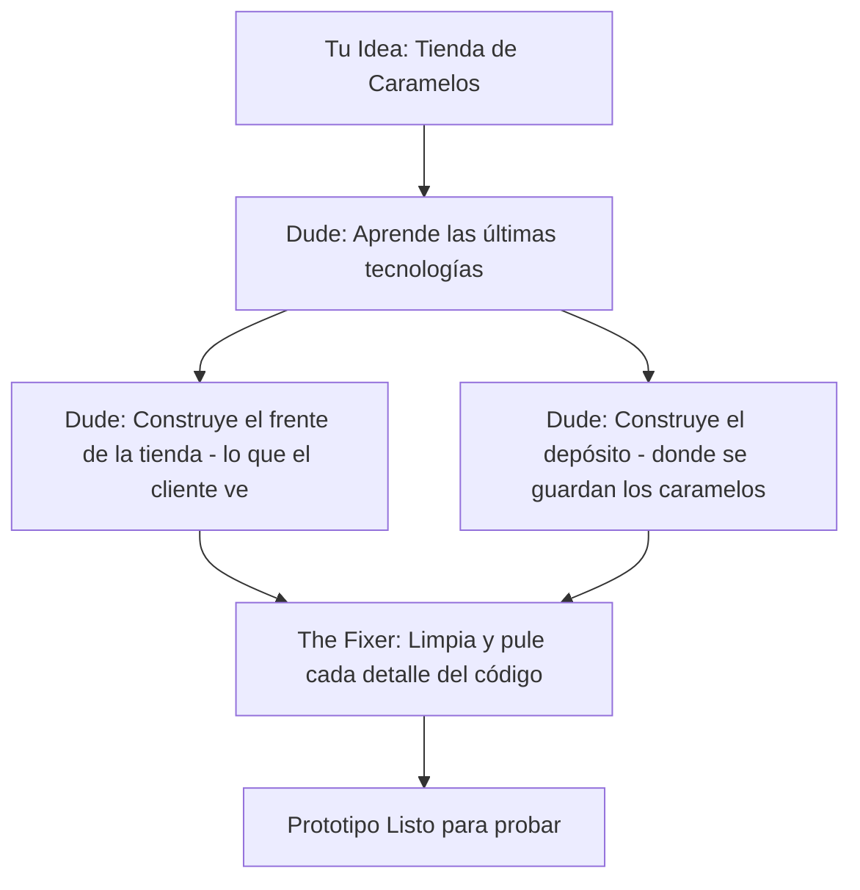

# 🍭 Guía CandyShop: Cómo trabaja "The Dude" para vos

Esta guía explica de forma sencilla cómo transformo tu idea de una **tienda de caramelos** en una aplicación real, profesional y segura, usando mi flujo de trabajo avanzado.

---

## 🧠 Fase 1: El Cerebro (Planificación y Aprendizaje)

| Paso | Nombre | ¿Qué hago? | Metáfora |
| :--- | :--- | :--- | :--- |
| **0. Orden** | **Git Flow** | Preparo el taller para que los cambios sean limpios y seguros. | *Limpiar la cocina.* |
| **0.5. Espionaje Pro** | **Intelligence** | **(Google/Reddit/Open-Aware)** Analizo qué hacen bien los líderes y de qué se quejan los clientes para que tu tienda sea la mejor. | *Ver qué vende el vecino y qué le falta.* |
| **1. Decisiones** | **ADR (#53)** | Registro por qué elegimos ciertas tecnologías (ej: Next.js + Supabase). | *Anotar la receta secreta.* |
| **2. Riesgos** | **Blast Radius** | Reviso si un cambio en el carrito podría afectar los pagos o el stock. | *Revisar el gas antes de hornear.* |
| **4. JIT Docs** | **Context7** | Me conecto a internet para leer las últimas reglas de las APIs (Stripe, etc.). | *Llamar al experto en ingredientes.* |

---

## 💡 El Plus de "The Dude": Inteligencia de Mercado
Antes de elegir los colores o las funciones, yo hago un **Benchmarking automático**:
*   **Reddit:** Detecto problemas comunes (ej: "envíos caros") para proponer soluciones (ej: "calculador de envío inteligente").
*   **Google:** Veo qué estéticas son tendencia para que tu tienda no parezca del 2010.
*   **Open-Aware:** Investigo código de tiendas exitosas para traerte funciones "Premium" de forma gratuita.

---

## 💪 Fase 2: El Músculo (Construcción Inteligente)
Aquí es donde la magia sucede y la página empieza a tomar forma.

### ¿Cómo escribo el código?
*   **Diseño Visual:** Uso mis "habilidades de artista" para que la tienda sea colorida, moderna y fácil de usar en celulares.
*   **Lógica de Venta:** Me aseguro de que si un cliente compra el último caramelo de menta, el sistema avise que ya no hay más.
*   **Corrección Automática:** Tengo un "corrector ortográfico" de código que arregla errores mientras escribo.

---

## 🛡️ Fase 3: El Escudo (Calidad y Seguridad)
No solo construyo la tienda, me aseguro de que nadie pueda entrar a robar y que todo funcione siempre bien.

1.  **Pruebas de Calidad:** Simulo compras para verificar que el dinero y los caramelos se cuenten bien.
2.  **Blindaje de Seguridad:** Protejo tu base de datos para que los datos de tus clientes estén bajo llave.
3.  **Manual de Instrucciones:** Te entrego una guía simple de cómo usar tu nueva tienda.
4.  **Entrega Final:** Subo todo a internet para que el mundo pueda comprar tus caramelos.

---

## ✨ El "Ingrediente Secreto": Actualización Total
A diferencia de otros, si mañana sale una forma más segura de cobrar con tarjeta, **no necesito que me lo expliques**. Mi sistema lo detecta solo, aprende la nueva forma en milisegundos y actualiza tu código automáticamente para que tu tienda nunca sea vieja.

**¿Empezamos a crear la estructura de tu CandyShop?**